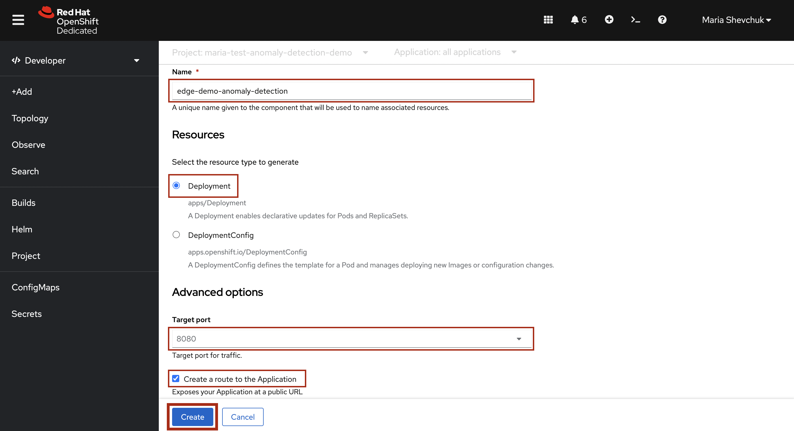

# Demo Deployment

In order to deploy the anomaly detection demo, 

  1. Go to the [OpenShift Console](https://console-openshift-console.apps.ieee.8goc.p1.openshiftapps.com/) and log in with your credentials. 

  2. Once you sign in, switch your view from Developer -> Administratior (located at the top of the sidebar). The Administrator view allows you to see every component of the cluster.

  3. Go to the "Projects" page and click the "Create Project" button in the top right corner.

  4. You will now need to create a project name, display name, and brief description of your project. Make sure that your project and display name do not contain any upper case letters and your project name does not contain any spaces. It is also good practice to keep your project and display names consistent, removing any hyphens or underscores in the latter, eg: 
  
     Name: test-anomaly-detection-demo
  
     Display name: test anomaly detection demo
     
 
     
  
  5. Once you are done creating your project, switch back to the Developer view, where we will containerize the source code from GitHub. 

  6. Once in the developer view, check that the correct project is selected from the dropdown menu at the top of the page. Then, head to the "+Add" page.

  7. Locate the "Git Repository" section and click "Import from Git". 

  8. You will now need to provide the [GitHub URL](https://github.com/Enterprise-Neurosystem/edge-demo-anomaly-detection) for the Anomaly Detection Demo. 
  
    URL: https://github.com/Enterprise-Neurosystem/edge-demo-anomaly-detection
  
  
  
  9. Once the Builder Image has been detected, you should see that Python 3.9 (UBI 8) has been automatically selected as the import strategy. This demo utilizes a different version of Python, so you will need to click on "Edit Import Strategy". 

  10. Select "3.8-ubi7" from the dropdown menu under "Builder Image version". Do not press "Create" just yet. 

  11. Scroll down and take note of the Application name. Make sure that the "Deployment" option is selected under "Resources". Under "Advanced options" leave the Target port at the default 8080 and make sure that the "Create a route to the Application" box is checked - this will create a public URL to your application. Once you ensure that all settings are correct, click "Create". 

  12. Go to the "Builds" page and click on your edge-demo-anomaly detection BuildConfig. 

  13. Next, go into the "Builds" environment. On this page you should see the status of your build ("Running", "Complete", or "Failed"). 

  Note: if your build fails, you can navigate to the "Logs" page by clicking on your build name and selecting "Logs" from the top menu. This will allow you to see the error and reason for the build failure. 
  
  14. Once the build is complete, go back to the "Topology" page. You now have access to the URL for your Application. 

  15. In the Application environment, you should seee two buttons: "Start Plot" and "Stop Plot". Click "Start Plot" to begin the data visualization. You should see data points starting to appear on the graph.

  16. Once enough data points have been plotted, a linear regression begins to take place which determines a mean standard deviation. The green peaks signify high pump pressure relative to the mean which constitutes an anomaly. In this example, our pump fails on October 3rd, at which point the plot stops. 

